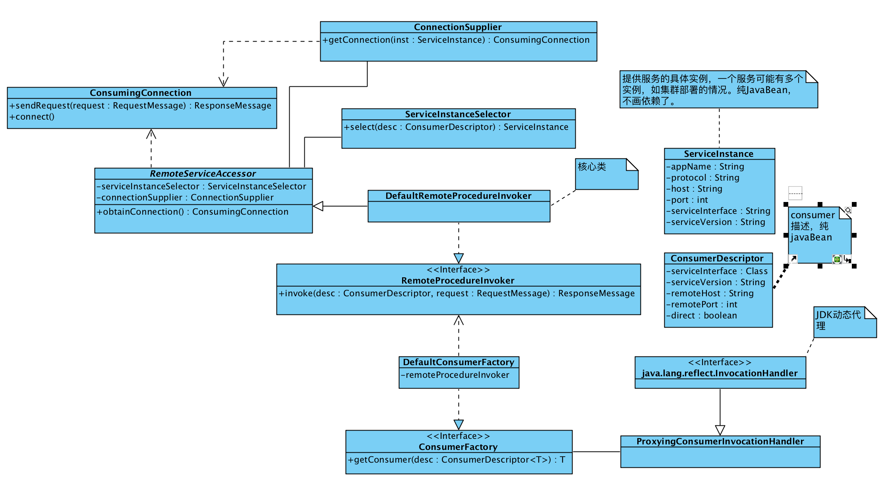

#自己动手实现RPC框架(2)－服务调用
## 索引
__replacing__

>代码库<br/>
>[https://github.com/destinyshine/storks-rpc.git](https://github.com/destinyshine/storks-rpc.git)

## 远程服务调用
在上一步，我们实现了一个服务发布程序，这一步我们要进行客户端调用。

### 实现细节
* 序列化，客户端和服务端使用相同的序列化协议，也就是protostuff。
* 网络，也使用netty发起客户端请求，客户端连接保持长链接。
* 动态代理，使用jdk原生的动态代理，也就是必须基于接口生成代理类。rpc调用本身需要依赖服务端API，因此没有问题。至于不需要依赖API的泛化调用，不是这一步考虑的问题。

### 设计
#### 类图概况
整体的类图如下：

#### 时序图


#### 重要类描述
* ConsumerFactory，负责根据提供的ConsumerDescriptor生成代理类，内部使用的JDK动态代理。
* RemoteProcedureInvoker，consumerFactory生产的代理类只是一个门面，内部实际调用委托给此类。这是最核心的一个骨架类。
	* ServiceInstanceSelector，服务实例选择器，根据制定的ConsumerDescriptor获取一个远程的服务实例（即ServiceInstance），ServiceInstance表示具体的服务实例，如集群中的某一个机器上的某一个服务。
		* 目前先实现一个直连的实现，DirectServiceInstanceSelector，直接根据Consumer配置的信息返回实例，不查询注册中心之类的组件。未来可以有其它实现。
	* ConnectionSupplier，实际是connection的工厂类，根据ServiceInstance生成ConsumingConnection，实现的时候需要考虑ServiceInstance指向的服务的协议，目前不考虑多协议。
		* 默认提供基于Netty NIO的长链接实现，序列化使用Protostuff。

### 代码实现

#### RemoteProcedureInvoker

RemoteServiceAccessor

```java
package io.destinyshine.storks.consumer;

import ...

/**
 * a base class for RemoteProcedureInvoker
 *
 * @author liujianyu.ljy
 * @date 2017/09/07
 */
@Slf4j
public abstract class RemoteServiceAccessor {

    protected ServiceInstanceSelector serviceInstanceSelector;
    protected ConnectionSupplier serviceReferSupplier;

    protected ConsumingConnection obtainConnection(ConsumerDescriptor<?> desc) throws Exception {
        ServiceKey serviceKey = ServiceKey.of(desc);

        Optional<ServiceInstance> instOpt = serviceInstanceSelector.select(desc);

        if (instOpt.isPresent()) {
            ServiceInstance inst = instOpt.get();
            return (serviceReferSupplier.getConnection(inst));
        } else {
            throw new ServiceNotFoundException("cannot found service of " + serviceKey + " in registry.");
        }
    }

    public void setServiceInstanceSelector(ServiceInstanceSelector serviceInstanceSelector) {
        this.serviceInstanceSelector = serviceInstanceSelector;
    }

    public void setConnectionSupplier(ConnectionSupplier serviceReferSupplier) {
        this.serviceReferSupplier = serviceReferSupplier;
    }
}

```

DefaultRemoteProcedureInvoker

```java
package io.destinyshine.storks.consumer;

import ...

/**
 * @author destinyliu
 */
@Slf4j
public class DefaultRemoteProcedureInvoker extends RemoteServiceAccessor implements RemoteProcedureInvoker {

    @Override
    public ResponseMessage invoke(ConsumerDescriptor desc, RequestMessage requestMessage) throws Exception {
        ConsumingConnection connection = obtainConnection(desc);
        Future<ResponseMessage> responsePromise = connection.sendRequest(requestMessage);
        return responsePromise.get();
    }

}
```

#### ServiceInstanceSelector

DirectServiceInstanceSelector

```java
package io.destinyshine.storks.core.consume.refer;

import ...

/**
 * 只支持直连的服务选择器
 *
 * @author liujianyu
 * @date 2017/09/03
 */
public class DirectServiceInstanceSelector implements ServiceInstanceSelector {

    @Override
    public Optional<ServiceInstance> select(ConsumerDescriptor desc) {
        if (desc.isDirect()) {
            ServiceInstance inst = ServiceInstance.builder()
                .host(desc.getRemoteHost())
                .port(desc.getRemotePort())
                .serviceInterface(desc.getServiceInterface().getName())
                .serviceVersion(desc.getServiceVersion())
                .build();
            return Optional.of(inst);
        }
        return Optional.empty();
    }

}

```

#### ConnectionSupplier

AbstractConnectionSupplier

```java
package io.destinyshine.storks.core.consume.refer;

import ...

/**
 * @author destinyliu
 */
@Slf4j
public abstract class AbstractConnectionSupplier implements ConnectionSupplier {

    private Map<ServiceInstance, ConsumingConnection> connectionCache = new ConcurrentHashMap<>();

    @Override
    public synchronized ConsumingConnection getConnection(ServiceInstance instance) throws Exception {
        ConsumingConnection con = connectionCache.computeIfAbsent(instance,
            instance1 -> {
                try {
                    return createConnectionInternal(instance1);
                } catch (Exception e) {
                    e.printStackTrace();
                }
                return null;
            });

        return con;
    }

    /**
     * create connection
     *
     * @param instance
     * @return
     * @throws Exception
     */
    protected abstract ConsumingConnection createConnectionInternal(ServiceInstance instance) throws Exception;

    public void shutdown() {
        logger.warn("shutting down connectionManager...");
        connectionCache.forEach((serviceKey, con) -> {
            logger.warn("closing all connections of serviceKey={}", serviceKey);
            try {
                con.close();
            } catch (Exception e) {
                logger.error(e.getMessage(), e);
            }
            logger.warn(
                "closed connection of serviceKey={}, {}",
                serviceKey,
                con
            );
            logger.warn("closed all connections of serviceKey={}", serviceKey);
        });
        logger.warn("shutdown connectionManager finished.");
    }
}
```

SocketChannelConsumingConnectionSupplier

```java
package io.destinyshine.storks.core.consume.refer;

import ...

/**
 * NIO consuming connection supplier.
 *
 * @author liujianyu
 * @date 2017/09/03
 */
@Slf4j
public class SocketChannelConsumingConnectionSupplier extends AbstractConnectionSupplier implements ConnectionSupplier {

    @Override
    public ConsumingConnection createConnectionInternal(ServiceInstance instance) throws Exception {
        logger.info("will create connection of instance {}", instance);
        String remoteHost = instance.getHost();
        int remotePort = instance.getPort();
        SocketChannelConsumingConnection con = new SocketChannelConsumingConnection(remoteHost, remotePort);
        con.connect();
        return con;
    }
}
```

#### ConsumingConnection

在ConsumingConnection的实现过程中，我们使用基于Netty 的NIO方式实现。由于NIO的response返回是异步的，并且发送Request后不会阻塞线程知道远程服务端返回详细；所以需要维护一个ConcurrentLinkedQueue<Promise<ResponseMessage>>队列，当发送一个请求的时候，增加一个Promise到队列中，并返回这个Promise。收到响应的时候取队头的Promise设置结果，在Promise上等待的线程可收到结果。可参考下面的代码。

Netty中的Promise是Future的子接口，类似于java8自带的CompletableFuture，能够增加监听器监听其是否完成，也能够手动设置结果。可参考java8的CompletableFuture.

实现代码。

```java
package io.destinyshine.storks.consumer.support;

import ...

/**
 * @author liujianyu
 */
public class SocketChannelConsumingConnection implements AutoCloseable, ConsumingConnection {

    private final Logger logger = LoggerFactory.getLogger(getClass());

    private ConcurrentLinkedQueue<Promise<ResponseMessage>> responsePromises = new ConcurrentLinkedQueue<>();

    private final String remoteHost;
    private final int remotePort;

    private Channel channel;

    private long connectedTime;

    public SocketChannelConsumingConnection(String remoteHost, int remotePort) {
        this.remoteHost = remoteHost;
        this.remotePort = remotePort;
    }

    @Override
    public void connect() throws Exception {
        EventLoopGroup group = new NioEventLoopGroup();
        try {
            Bootstrap bootstrap = new Bootstrap();
            bootstrap.group(group);
            bootstrap.channel(NioSocketChannel.class);
            bootstrap.remoteAddress(new InetSocketAddress(remoteHost, remotePort));
            bootstrap.handler(new ChannelInitializer<SocketChannel>() {

                @Override
                public void channelActive(ChannelHandlerContext ctx) throws Exception {
                    super.channelActive(ctx);
                }

                @Override
                public void initChannel(SocketChannel ch) throws Exception {
                    ch.pipeline()
                        .addLast(new ProtostuffEncoder<>(RequestMessage.class))
                        .addLast(Protocol.newFrameDecoder())
                        .addLast(new ProtostuffDecoder<>(ResponseMessage.class, ResponseMessage::new))
                        .addLast(new SimpleChannelInboundHandler<ResponseMessage>() {
                            @Override
                            protected void channelRead0(ChannelHandlerContext ctx, ResponseMessage msg)
                                throws Exception {
                                Promise<ResponseMessage> promise;
                                if ((promise = responsePromises.poll()) != null) {
                                    promise.setSuccess(msg);
                                } else {
                                    logger.error("remote server closed!");
                                }
                            }
                        });
                }
            });
            ChannelFuture channelFuture = bootstrap.connect().sync();
            this.channel = channelFuture.channel();
            this.connectedTime = System.currentTimeMillis();
            channelFuture.addListener(future -> {
                if (future.isSuccess()) {
                    logger.debug(future.toString() + "client connected");
                } else {
                    logger.debug(future.toString() + "server attemp failed", future.cause());
                }

            });
        } finally {

        }
    }

    @Override
    public Promise<ResponseMessage> sendRequest(RequestMessage requestMessage) {
        Promise<ResponseMessage> promise = this.channel.eventLoop().newPromise();
        this.responsePromises.add(promise);
        this.channel.writeAndFlush(requestMessage);
        return promise;
    }

    @Override
    public String toString() {
        return "SocketChannelConsumingConnection{" +
            "remoteHost='" + remoteHost + '\'' +
            ", remotePort=" + remotePort +
            '}';
    }

    @Override
    public void close() {
        channel.close().awaitUninterruptibly();
    }
}
```

#### 运行客户端
同样使用原始的方式执行客户端代码。

在这个实例中，用多个线程发起并行RPC调用，试验是否能够正确响应，多个线程之间是否会错乱。经过试验多线程正常调用和响应。

```java
package io.destinyshine.storks.sample.service;

import ...

/**
 * @author liujianyu
 */
public class DirectClientMain {

    private static final Logger logger = LoggerFactory.getLogger(DirectClientMain.class);

    public static void main(String[] args) throws Exception {

        DefaultRemoteProcedureInvoker invoker = new DefaultRemoteProcedureInvoker();
        invoker.setConnectionSupplier(new SocketChannelConsumingConnectionSupplier());
        invoker.setServiceInstanceSelector(new DirectServiceInstanceSelector());

        ConsumerDescriptor<HelloService> desc = ConsumerBuilder
            .ofServiceInterface(HelloService.class)
            .remoteServer("127.0.0.1")
            .remotePort(39874)
            .serviceVersion("1.0.0")
            .direct(true)
            .build();

        ConsumerFactory consumerProxyFactory = new DefaultConsumerFactory(invoker);

        HelloService helloServiceConsumer = consumerProxyFactory.getConsumer(desc);

        ExecutorService executorService = Executors.newFixedThreadPool(10);

        for (int i = 0; i < 100; i++) {
            int finalI = i;
            executorService.submit(() -> {
                String input = null;
                String result = null;
                try {
                    input = "tom,direct," + Thread.currentThread().getName() + "," + finalI;
                    result = helloServiceConsumer.hello(input);
                } catch (Exception e) {
                    logger.error(e.getMessage(), e);
                }
                logger.info("input={}, get result: {}", input, result);
            });
        }

        Runtime.getRuntime().addShutdownHook(new Thread(() -> {
            try {
                invoker.close();
            } catch (Exception e) {
                logger.error(e.getMessage(), e);
            }
        }));

    }
}

```


 